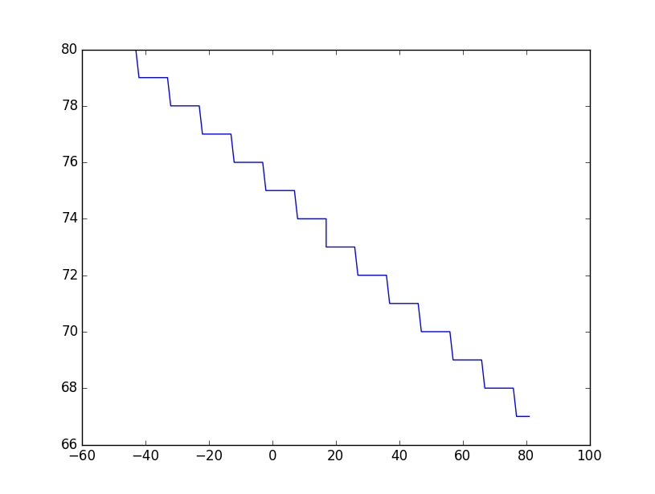
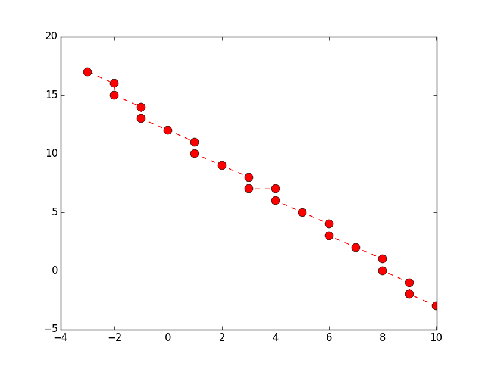

# Алгоритм DDA-линии. Растеризация отрезка прямой между двумя заданными точками.

Описание алгоритма: [ru.wikipedia.org/wiki/Алгоритм_DDA-линии](https://ru.wikipedia.org/wiki/Алгоритм_DDA-линии)

Зависимости:
* Python 3+
* matplotlib
* numpy

По полученным результатам есть возможность построить график:

