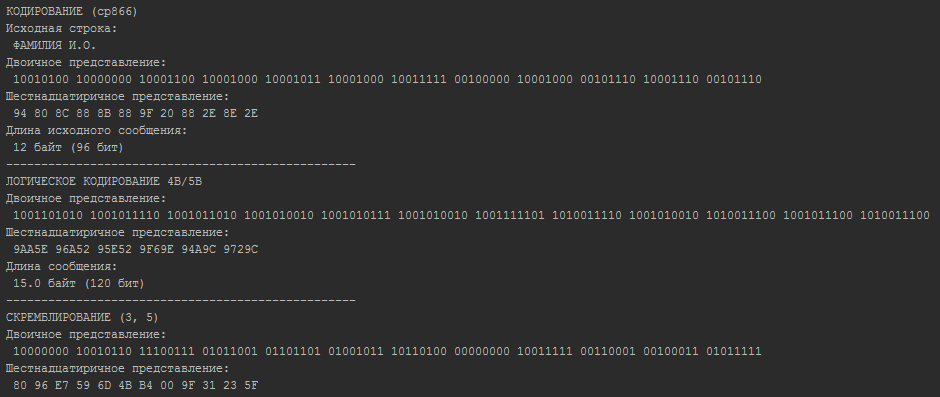
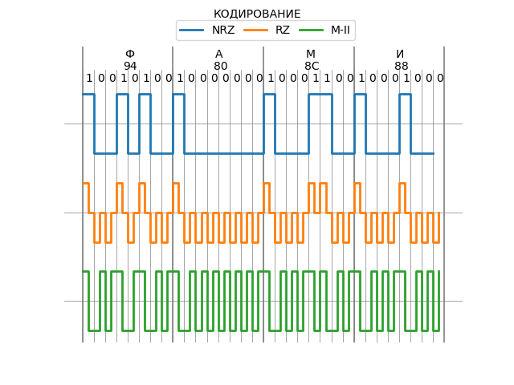
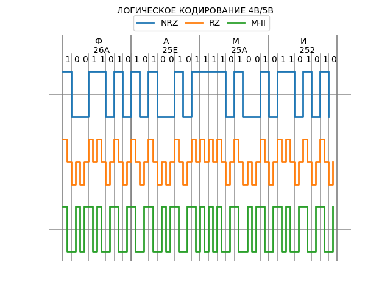
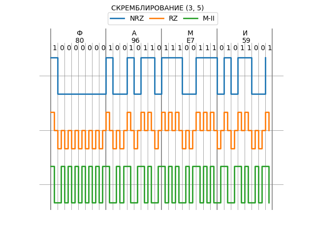

nets.py — скрипт для кодирования строк различными видами кодирования и построения временных диаграм по результатам
==================================================================================================================

Требования
----------

* Python 3.6
* matplotlib 2.0.0

Скриншоты
---------

